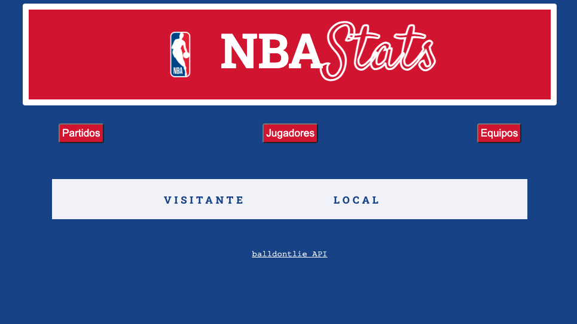
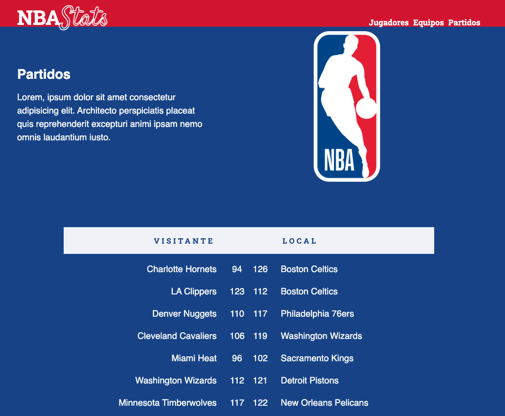
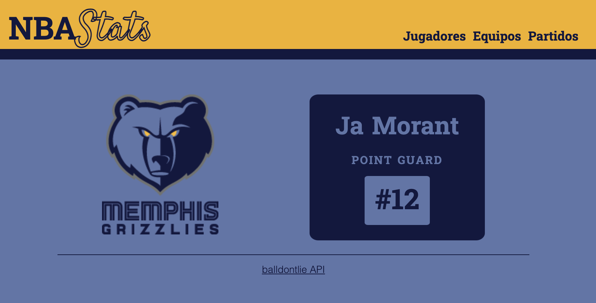

# **NBA Stats**  

NBA Stats es un proyecto realizado con HTML, CSS y JavaScript. Recibe datos de [balldontlie](https://www.balldontlie.io/), que es una API que da acceso a datos sobre la [NBA](https://es.wikipedia.org/wiki/National_Basketball_Association) de baloncesto.

## Consideraciones Iniciales:
Para la elección de la API, se ha elegido esta porque dentro de las APIs proporcionadas y de contenido NBA, es la única con HTTPS y CORS adecuados. Después de una primera observación, el contenido de la misma sobre jugadores, equipos, estadísticas,... es apropiado para la realización del *Proyecto Final*.

## Desarrollo:
El primer paso, basado en el ejemplo de la *Sesión Síncrona 3*, ha sido acceder a los datos de la API para realizar un análisis más exhaustivo. Después, con lo explicado en la *Sesión Síncrona 4*, se ha hecho una prueba con datos de partidos proporcionados por la API y se ha realizado un primer diseño bastante rudimentario:  

  

Más adelante, se ha empezado a trabajar con Flexbox para optimizar el diseño de la página y para acercarse más a un posible diseño final:  

  

El siguiente paso, ha sido empezar a elaborar los estilos por equipos. En la medida de lo posible, la idea es crear unos estilos CSS para cada equipo de la NBA, para que cuando se realice una búsqueda por jugador o por equipo salgan los colores de cada equipo. Se implementará con la ayuda de la página [Sports Fan Covers](https://sportsfancovers.com/nba-team-colors/), para la correcta selección de los colores de cada equipo. Al ser 30 equipos no sé si será factible llevar a cabo esta tarea o requerirá de un tiempo desproporcionado.

Con lo explicado en la *Sesión Síncrona 6*, se ha implementado un primer diseño de como sería una página de un equipo selecionado:

   

Después de un tiempo sin avanzar el proyecto, he decidido reemprenderlo realizando una página con todos los logos de los equipos NBA (teams.html), divididos por conferencias. Una vez pinchando en el logo de un equipo, la idea era generar una tabla con los jugadores de ese equipo buscando en la API. Entonces ha surgido un problema, que habrá que evaluar para encontrar una posible solución o descartar la idea. Ya que la URL de jugadores está divida en 151 páginas con 25 jugadores por lo que las llamadas a la API con los awaits correspondientes retrasan demasiado la ejecución. Además, que la API solo permite 60 llamas al minuto, por lo que se me ha bloqueado. 

Finalmente, se ha llegado a la solución (gracias, Albert) de hacer llamadas a la API haciendo búsquedas de por 100 elementos. Otro de los problemas que ha surgido, es que la información de los jugadores en la API está dividida en dos. Por una parte, la API ofrece [información de los jugadores](https://www.balldontlie.io/api/v1/players) como el equipo en el que juegan, el peso, la altura o su posicion y por otro lado ofrece las [estadísticas de los jugadores](https://www.balldontlie.io/api/v1/stats). La idea era generar una tabla con toda esta información, pero al multiplicarse por dos las llamadas a la API se multlipicaría la latencia al generar las tablas.

La solución a la que se ha llegado, ha sido generar una tabla solo con la primera información y crear un enlace en el nombre del jugador, que al pinchar, llevaría a una página con información más extensa sobre el jugador (player.html), ya con todos los datos de las dos llamadas a la API. 

Se ha seguido el trabajo, generando esta página sobre jugadores. El primer paso, ha sido establecer un input y un botón para hacer un búsqueda de un determinado jugador por parte del usuario. Con la opción que ofrece la API para realizar búsquedas (?search=davis) dicha ejecución ha sido realmente sencilla, ya que ofrece unos resultados bastante óptimos. 

Para los resultados de la búsqueda, se ha realizado un condicional con tres opciones:
+ Jugador encontrado. Que llevará al usuario a la página del jugador con información del mismo.
+ La búsqueda ofrece muchos jugadores, por la similaridad del nombre. Este resultado imprimirá una lista con los jugadores encontrados y el usuario puede seleccionar el que está buscando, al pinchar, se redireccionará a la página con información de dicho jugador.
+ Jugador no encontrado. Se imprime por pantalla dicho mensaje.  

Debido a la limitación de las llamadas a la API y para corregir la latencia en la carga, se ha tomado la medida de poner unos límites dentro de la página. Después de un estudio la información, al entrar en la sección de equipos y hacer un búsqueda, se ofrecerán resultados de las últimas páginas de la API, que coincide con los jugadores que están en activo.  
Otra limitación que se ha puesto, ya que la información sobre estadísticas está dividida por años, es limitar la información entregada al último año jugado por ese jugador y limitar la información hasta el año 2000. Ya que si hacemos la búsqueda de un jugador que si último año fue en 1980 y empezamos a buscar desde el año 2021, tendríamos que hacer 41 llamadas a la API para obtener ese resultado, por lo que casi se estaría llegando al límites puesto por la API.  

## Consideraciones finales y desarrollo futuro:  
El desarrollo de la aplicación ha estado marcada por las limitaciones que exigía la API, ya que sin estas limitaciones se podría haber ido más allá en el desarrollo de la misma. Uno de los objetivos para un futuro sería encontrar la manera de obtener más información teniendo en cuenta está limitación.
Otra de las vías para un desarrollo futuro, sería la de trabajar con la información sobre partidos. Habría que analizar de que manera se podría realizar este trato de esta información ya que la parte sobre partidos de esta API es un poco difusa.  
También se estudiará la idea que se echó para atrás durante el proceso de tener un CSS para cada equipo.  
Finalmente, otra posibilidad sería la de ofrecer búsquedas en base a los años. Es decir, buscar la información de X jugador en determinada temporada. Ya que de momento, solo se ofrece información del último año jugado.   