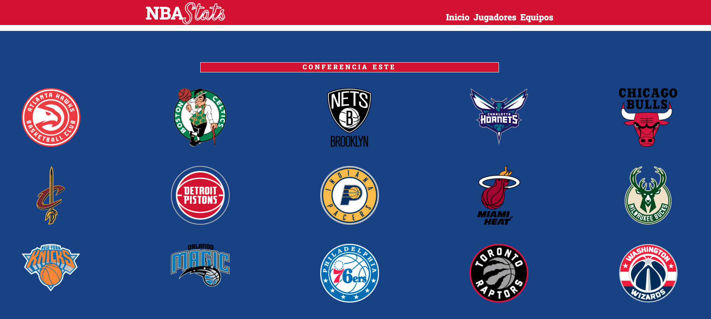

# **NBA Stats**  

NBA Stats es un proyecto realizado con HTML, CSS y JavaScript. Recibe datos de [balldontlie](https://www.balldontlie.io/), que es una API que da acceso a datos sobre la [NBA](https://es.wikipedia.org/wiki/National_Basketball_Association) de baloncesto entre los años 1979 y 2021, sobre jugadores, equipos y partidos.

## Consideraciones Iniciales:
Para la elección de la API, se ha elegido esta porque dentro de las APIs proporcionadas y de contenido NBA, es la única con HTTPS y CORS adecuados. Después de una primera observación, el contenido de la misma sobre jugadores, equipos, estadísticas,... es apropiado para la realización del *Proyecto Final*.

## Desarrollo:
El primer paso, basado en el ejemplo de la *Sesión Síncrona 3*, ha sido acceder a los datos de la API para realizar un análisis más exhaustivo. Después, con lo explicado en la *Sesión Síncrona 4*, se ha hecho una prueba con datos de partidos proporcionados por la API y se ha realizado un primer diseño bastante rudimentario:  

    

Más adelante, se ha empezado a trabajar con Flexbox para optimizar el diseño de la página y para acercarse más a un posible diseño final de lo que será el index.html:  

   

El siguiente paso, ha sido empezar a elaborar los estilos por equipos. En la medida de lo posible, la idea es crear unos estilos CSS para cada equipo de la NBA, para que cuando se realice una búsqueda por jugador o por equipo salgan los colores de cada equipo. Se implementará con la ayuda de la página [Sports Fan Covers](https://sportsfancovers.com/nba-team-colors/), para la correcta selección de los colores de cada equipo. Al ser 30 equipos no sé si será factible llevar a cabo esta tarea o requerirá de un tiempo desproporcionado.

Con lo explicado en la *Sesión Síncrona 6*, se ha implementado un primer diseño de como sería una página de un equipo selecionado:

   

Después de un tiempo sin avanzar el proyecto, he decidido reemprenderlo realizando una página con todos los logos de los equipos NBA (teams.html), divididos por conferencias.  

  

Mediante un template, al que se llama dos veces, imprime por pantalla los logos guardados en arrays. Despúes, el usuario podrá pincjar en el logo de un equipo y guardando la información de la ID del equipo (que coincide con la del png) en localStorage, la idea será generar un html nuevo con una tabla con los jugadores de ese equipo buscando en la API.  

Entonces ha surgido un problema, que habrá que evaluar para encontrar una posible solución o descartar la idea. Ya que la URL de jugadores está divida en 151 páginas con 25 jugadores por lo que las llamadas a la API con los awaits correspondientes retrasan demasiado la ejecución. Además, que la API solo permite 60 llamas al minuto, por lo que se me ha bloqueado. 

Finalmente, se ha llegado a la solución (gracias, Albert) de hacer llamadas a la API haciendo búsquedas de por 100 elementos. Otro de los problemas que ha surgido, es que la información de los jugadores en la API está dividida en dos. Por una parte, la API ofrece [información de los jugadores](https://www.balldontlie.io/api/v1/players) como el equipo en el que juegan, el peso, la altura o su posicion y por otro lado ofrece las [estadísticas de los jugadores](https://www.balldontlie.io/api/v1/stats). La idea era generar una tabla con toda esta información, pero al multiplicarse por dos las llamadas a la API se multlipicaría la latencia al generar las tablas.

La solución a la que se ha llegado, ha sido generar una tabla solo con la primera información y crear un enlace en el nombre del jugador, que al pinchar, llevaría a una página con información más extensa sobre el jugador (player.html), ya con todos los datos de las dos llamadas a la API.  

Llegado a este punto se han implementado dos módulos: uno para las llamadas a la API con fetch y otro que transforma la altura y el peso a sistema métrico.  

Se ha seguido el trabajo, generando la página sobre jugadores. El primer paso, ha sido establecer un input y un botón para hacer un búsqueda de un determinado jugador por parte del usuario. Con la opción que ofrece la API para realizar búsquedas (?search=davis) dicha ejecución ha sido realmente sencilla, ya que ofrece unos resultados bastante óptimos. 

Para los resultados de la búsqueda, se ha realizado un condicional con tres opciones:
+ Jugador encontrado: Que llevará al usuario a la página del jugador con información del mismo.
+ La búsqueda ofrece muchos jugadores, por la similaridad del nombre: Este resultado imprimirá una lista con los jugadores encontrados y el usuario puede seleccionar el que está buscando, al pinchar, se redireccionará a la página con información de dicho jugador.
+ Jugador no encontrado: Se imprime por pantalla dicho mensaje.  

Debido a la limitación de las llamadas a la API y para corregir la latencia en la carga, se ha tomado la medida de poner unos límites dentro de la página. Después de un estudio la información, al entrar en la sección de equipos y hacer un búsqueda, se ofrecerán resultados de las últimas páginas de la API, que coincide con los jugadores que están en activo.  

Otra limitación que se ha puesto, ya que la información sobre estadísticas está dividida por años, es limitar la información entregada al último año jugado por ese jugador y limitar la información hasta el año 2000. Ya que si hacemos la búsqueda de un jugador que su último año fue en 1980 y empezamos a buscar desde el año 2021, tendríamos que hacer 41 llamadas a la API para obtener ese resultado, por lo que casi se estaría llegando al límites puesto por la API.  

Justo después de escribir el último párrafo, se me ha ocurrido que el usuario pueda seleccionar el año del que desea ver las estadísticas del jugador. Así que he creado un *form* para que se pueda seleccionar dentro de los años 1979 a 2021. Así se limitan las llamadas a la API. Habrá que considerar más tarde, si una vez dentro de la página del jugador, el usuario podrá seleccionar otro año y así que se vaya añadiendo a la tabla que se creará.  

El último paso ha sido implementar la página de jugadores (player.html). El usuario puede llegar desde dos vías: desde la página de equipos, pinchando en el nombre de un jugador o desde el buscador. Si se llega desde la primera opción, utilizamos la información guardada en localStorage para ahorrar una llamada a la API. Si se obtiene una búsqueda desde el buscador, cuando se encuentra el jugador ya tendríamos la información (peso, altura, posición,...) del jugador y luego con el año, se llamaría a la API para obtener la información sobre partidos, puntos, asistencias... 

Para imprimir por pantalla la primera información, se ha aprovechado el *template* que se usaba en la página de equipos. Si el tiempo lo permite, más adelante se podría evaluar si es posible meter esa información en un módulo. Para imprimir el segundo bloque de información se ha creado una tabla mediante un *template*. Si el jugador buscado, no ha jugado el año seleccionado, se imprimirá un mensaje por pantalla.  

En estos últimos días, he estado intentando corregir un pequeño error, ya que cuando se llega a player.html desde la pantalla de equipos, hay un pequeño instante que se ve el buscador. Se está probando a meter el buscador via template, desde un *if* que busca si hay información en el localStorage, pero de momento el addEventListener está dando un error que no sé detectar.  

Finalmente, se ha echado para atrás la idea del uso del template, debido a no encontrar solución para lo comentado anteriormente.  

Con el tiempo que resta para la entrega, se da por finalizado el Proyecto Final. Estos últimos días los quiero dedicar a poner un poco de orden y a borrar cosas que finalmente no se han usado.  

## Consideraciones finales y desarrollo futuro:  
El desarrollo de la aplicación ha estado marcada por las limitaciones que exigía la API, ya que sin estas limitaciones se podría haber ido más allá en el desarrollo de la misma. Uno de los objetivos para un futuro sería encontrar la manera de ofrecer más información teniendo en cuenta está limitación.  

Para un futuro inmediato se ha de corregir el error de que se vea el buscador viniendo de la página de equipos.  

Otro error que hay que corregir y que no he sabido detectar, es que los textos de la barra de menú se mueven cuando se pasa de la página de inicio a la de equipos. También, cuando se termina de imprimir la tabla con los jugadores del equipo se ve ese leve movimiento en la barra de menú. En las investigaciones que he hecho, creo que puede ser al llamar al template, pero lo cierto es que no lo tengo nada claro.  

También se estudiará la idea de encapsular alguna función más dentro de módulos. Con las funciones de *selectPlayer* de *scriptteam.js* y de *scriptplayer.js* hubo un intento, pero debido al fiasco inicial y a la falta de tiempo se desechó esta idea.  

Un de las vías para un desarrollo futuro, sería la de trabajar con la información sobre partidos. Habría que analizar de que manera se podría realizar este trato de esta información ya que la parte sobre partidos de esta API es un poco difusa.   

También se estudiará la idea que se echó para atrás durante el proceso de tener un CSS para cada equipo y poner todo el contenido en castellano, ya que hay información que sigue en inglés ya que que está tal cual como viene de la API.  

Finalmente, otra posibilidad sería la de ampliar la búsqueda por año. Una vez dentro de la información del jugador, dejar el formulario de los años e ir imprimiendo en base a la selección del usuario. 